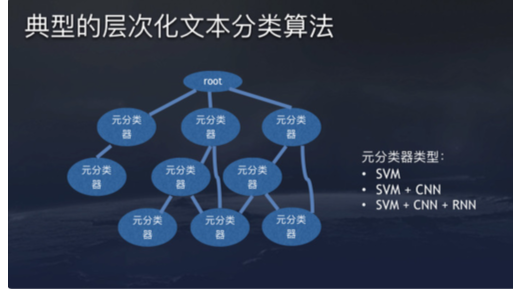

# 中文文本多层分类数据集

这是[另一个数据集](https://github.com/fateleak/toutiao-text-classfication-dataset)的加强版，为多级分类，分类更全（含1000+多级分类），量更大。


<br />

数据来源：

今日头条客户端


<br />

文本多层分类的概念见下图




<br />


数据格式：

```
1000866069|,|tip,news|,|【互联网资讯】PPT设计宝典!十招教你做出拿得出手的PPT|,|互联网,美国,ppt,powerpoint,幻灯片,演示文稿,微软,字体列表|,|
```

每行为一条数据，以`|,|`分割的各字段，从前往后分别是 新闻ID，分类代码，新闻字符串（仅含标题），新闻关键词，新闻label


<br />


所有分类的目录见 `all_cat.txt`


<br />


数据规模：

共2914000条，分布于1000+个多层的类别中。


<br />


采集时间：

2018年06月


<br />


NLP chat group：


<br />

LISCENSE


[WTFPL](https://zh.wikipedia.org/zh-hans/WTFPL)